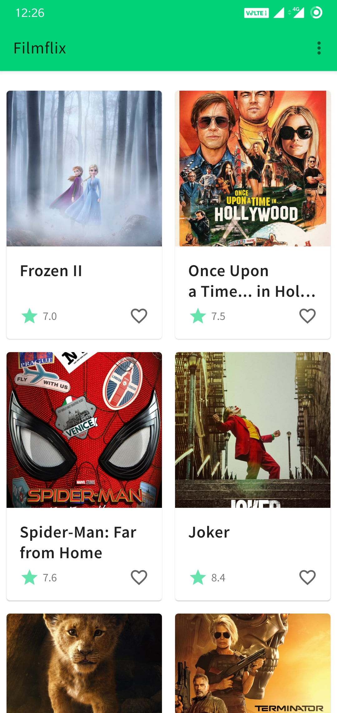
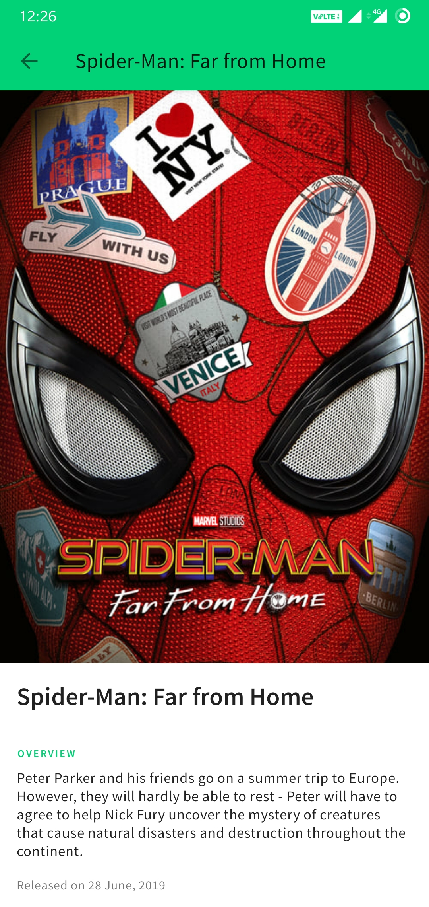
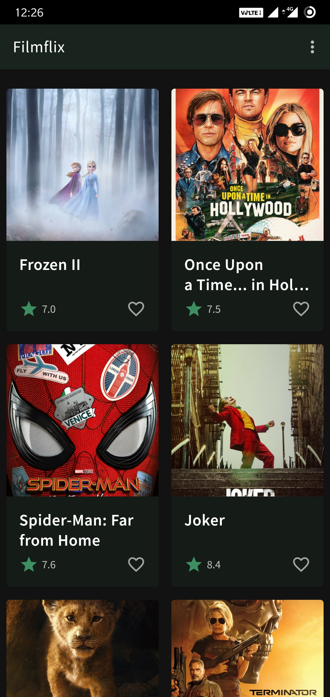
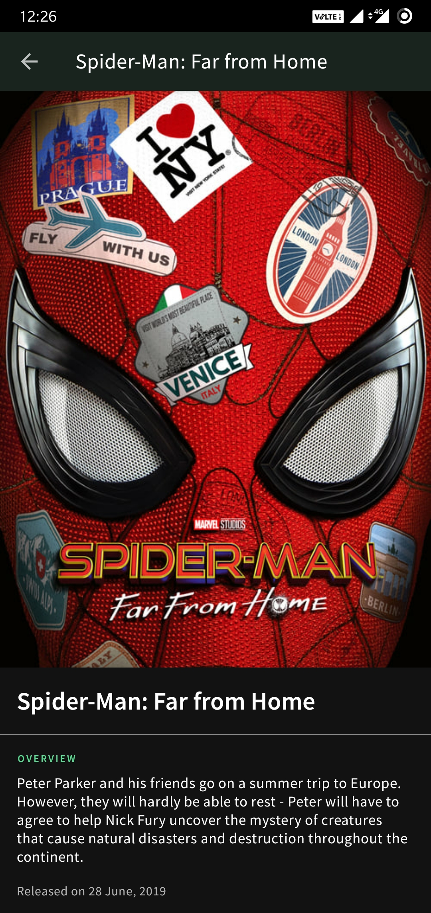

<h3>A popular movies app.<h3>
 
 
<li>Retrofit</li>
<li>MVVM pattern</li>
<li>Light and dark themes</li>
<li>Data binding</li>
<li>Paging</li>
 
 

 
 
 
 

 
 
 
 

 
 
 
 

 
 
TO DO:
 
 
<li>Add save functionality using room</li>
<li>Palette implementation</li>
<li>More endpoints</li>
